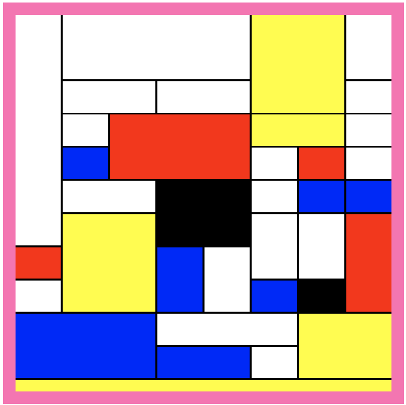

# Assignments week 2

# Assignment 1

See the two websites below. Navigate to them and do all the exercises. This will greatly enhance your skills with the
flexbox and grid.

* [CSS Grid Garden](https://cssgridgarden.com/)
* [CSS Flex Froggy](https://flexboxfroggy.com/)

## Assignment 2: rebuild a Mondriaan like painting in HTML

Having a lot of experience now in the use of `display:grid` you can work on the next exercise.

Build the following "painting" in a website using `display:grid`. The "painting" consists of the red/blue/white/yellow
squares. The pink border is considered the painting's frame.

Requirements:

* use a `display:grid`
* do not work with hard measurements like `10px` for the painting shapes.
* use only one container (e.g. `section`) as the parent for all the painting shapes.

Information about this assignment:

* background color surrounding the image is `hotpink`.
* the `hotpink` border is 20px wide/height.
* the total area is 600x600 pixels.
* this black lines are 3px thick.

# Calculation with dates

Create a variable called date and store the following number 14062016. This number stands for 14th of June 2016.

Use the operators Modulo (%) and Division (/), and only these operators, to extract the day, month and year in different
variables. Your answer should work with all different possibilities for variable date. 

